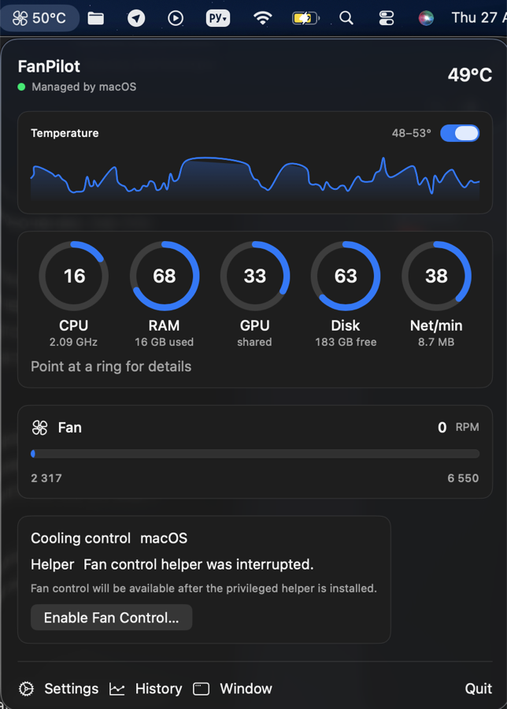
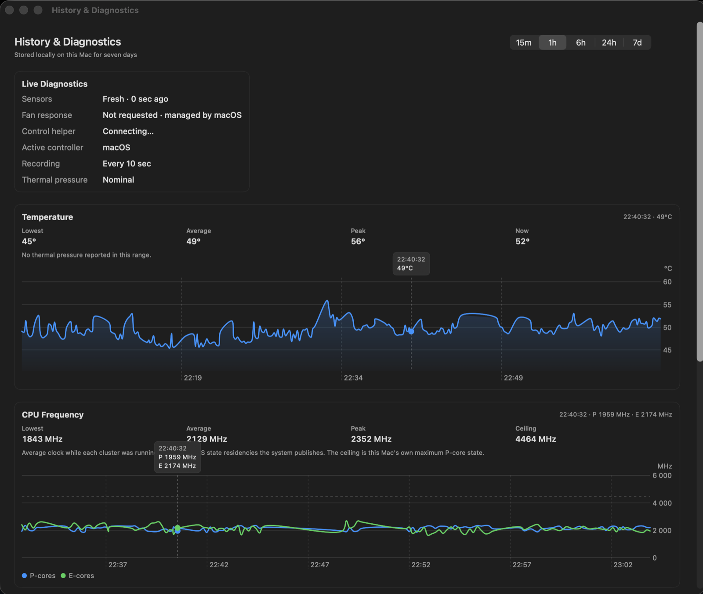
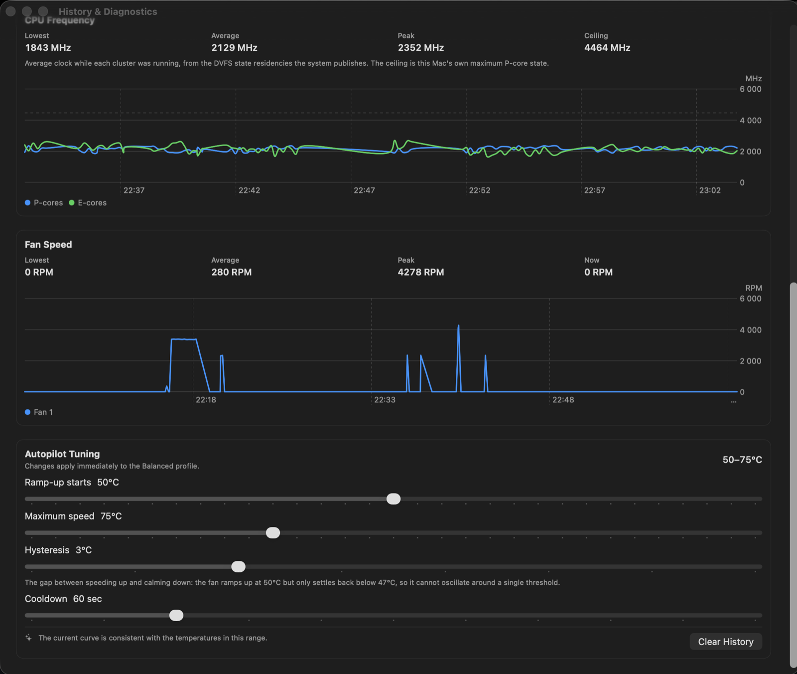

# FanPilot

A native macOS menu bar app for watching what a MacBook is doing thermally — and, when you ask it to, for driving the fans yourself.

Built for Apple Silicon — developed on a 14-inch MacBook Pro with the base M4, which reports itself as `Mac16,1` — with Intel fallbacks in the sensor layer.

<p align="center">
  
</p>

The popover: temperature in the menu bar, a sparkline of the last readings, five rings for CPU, memory, GPU, disk and network, and who is currently in charge of cooling. Pointing at a ring spells its reading out in full underneath.



History &amp; Diagnostics. One cursor drives every chart, so the temperature and the clock under the pointer belong to the same moment.



CPU frequency against this Mac's own ceiling, fan speed, and the autopilot curve — each control explaining itself with the numbers currently in effect.

## What it shows

- Temperature from every plausible SMC sensor, refreshed on your own schedule, with a sparkline in the menu bar popover.
- CPU, RAM, GPU, disk and network as compact rings. The CPU ring reads the real clock, not a load percentage.
- **Actual CPU frequencies.** Apple Silicon publishes no frequency counter, so FanPilot reads the DVFS state residencies the system exports through IOReport and combines them with this Mac's own voltage tables from `pmgr`. On an M4 that resolves to the documented ceilings — 4464 MHz for the P-cluster, 2892 MHz for the E-cluster.
- Thermal pressure over time, drawn as bands behind the temperature and frequency charts, so you can see when the system said it was struggling.
- Seven days of local history with a hover cursor across all charts, per-range statistics, and live diagnostics.

## Fan control

Three modes: **System** (macOS decides, always the default at launch), **Auto** (a temperature curve with prediction, hysteresis, cooldown and rate limiting) and **Manual**.

Writing to the SMC needs root, so fan control runs through a privileged helper installed with `SMAppService` and reached over XPC. Safety rules the helper enforces:

- Requested RPM is always clamped to the range the firmware reports for that fan.
- Every fan the helper touched is returned to macOS when heartbeats stop for six seconds, before sleep, at helper start-up after a crash, or whenever the app asks.
- A fan that refuses to switch back stays on the retry list, and the thermal unlock is held until every fan is verified to be back under system control.
- If the connection is lost, the app drops to System mode and says so rather than pretending it is still in charge.

On a Mac without fans — the Airs — FanPilot says so and runs monitoring-only: temperature, frequencies, rings and history all work, the mode picker is hidden, and the privileged helper is not offered at all, because a root daemon that cannot reach a fan is risk without benefit.

Not every Mac hands its fans over. The SMC on Apple Silicon rejects manual mode intermittently; FanPilot retries for a few seconds and then tells you, instead of silently reverting.

## Build

```bash
zsh scripts/build-app.sh
open dist/FanPilot.app
```

Then open Settings and choose **Enable Fan Control…**. macOS asks for approval in **System Settings → General → Login Items & Extensions**.

Unsigned builds pin the helper by code hash, which changes on every rebuild, so after rebuilding press **Reinstall Helper** in Settings once. Signed builds pin by team identifier instead and survive rebuilds.

To work in Xcode, open `Package.swift` and pick the **FanPilot App** scheme: it assembles the bundle and launches it. The plain `FanPilot` scheme runs the bare executable, which works for monitoring but cannot install the helper.

## Downloading a release

Releases are built by GitHub Actions. Unless a release is signed with a Developer ID and notarized, macOS will refuse to open it and, more importantly, **the privileged helper will not register — fan control will not work.** Monitoring still does. For fan control on your own machine, build from source with the command above.

## Requirements

macOS 14 or later. No telemetry: settings, history and diagnostics never leave the machine.
